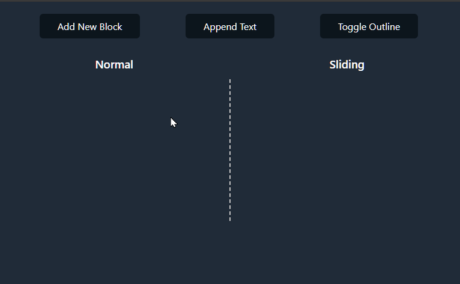

# Sliding TextBox Demo

A demonstration of smooth scrolling implementation to improve readability in translation subtitle systems.

When new text is added, typical implementations cause existing text to jump abruptly, making it difficult to read. The SlidingTextBox component solves this problem with smooth animation display.

**Left (Normal)**: Abrupt scrolling  
**Right (Sliding)**: Smooth slide-in animation

[Demo](https://sample-by-jsakamoto.github.io/React-SlidingTextBox/)




## Getting Started

### Prerequisites

- Node.js (v20 or later)
- npm (Node Package Manager)

### Installation
1. Clone the repository:
   ```bash
   git clone https://github.com/sample-by-jsakamoto/React-SlidingTextBox.git
   ```
2. Navigate to the project directory:
   ```bash
   cd React-SlidingTextBox
   ```
3. Install dependencies:
   ```bash
   npm ci
   ```
### Running the Application

4. Start the development server:
   ```bash
    npm run dev
    ```

## License

This project is released into the public domain under [The Unlicense](LICENSE).
